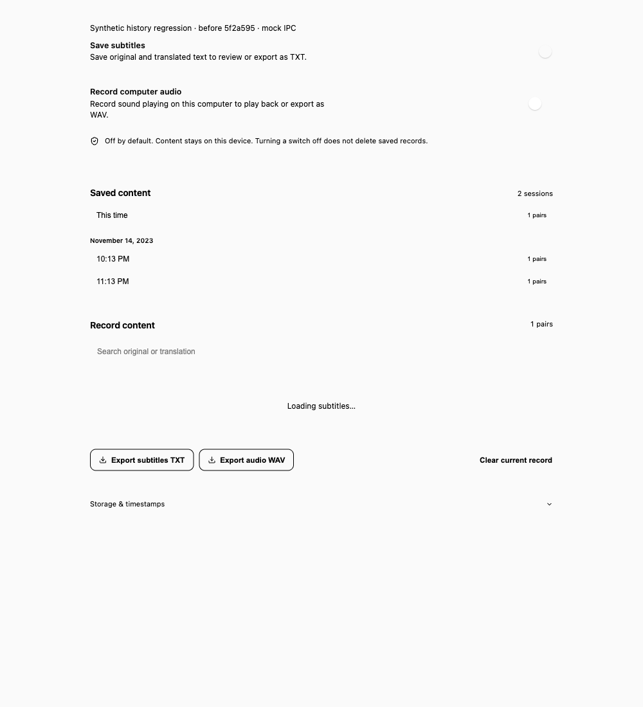
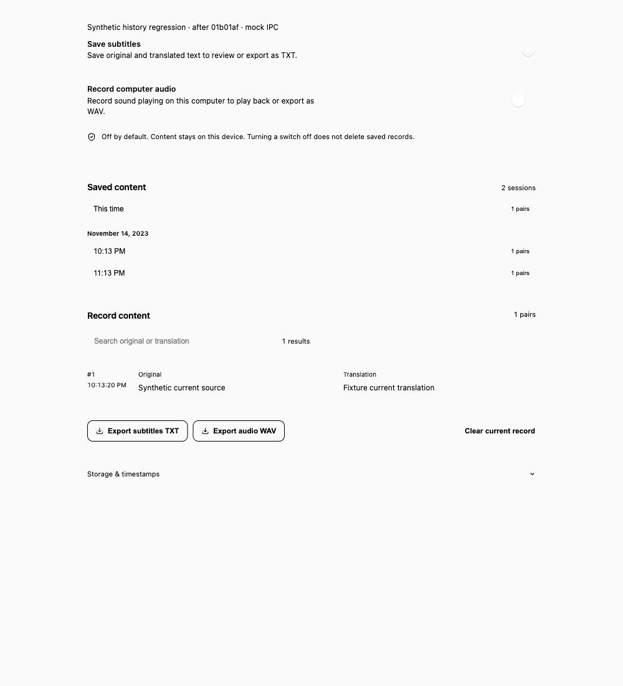
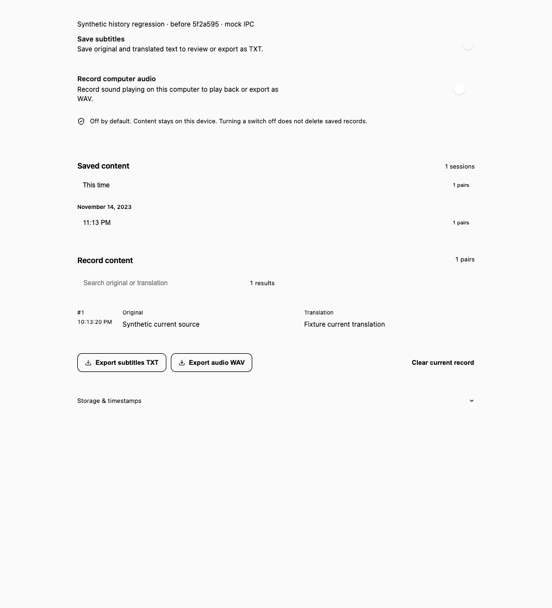
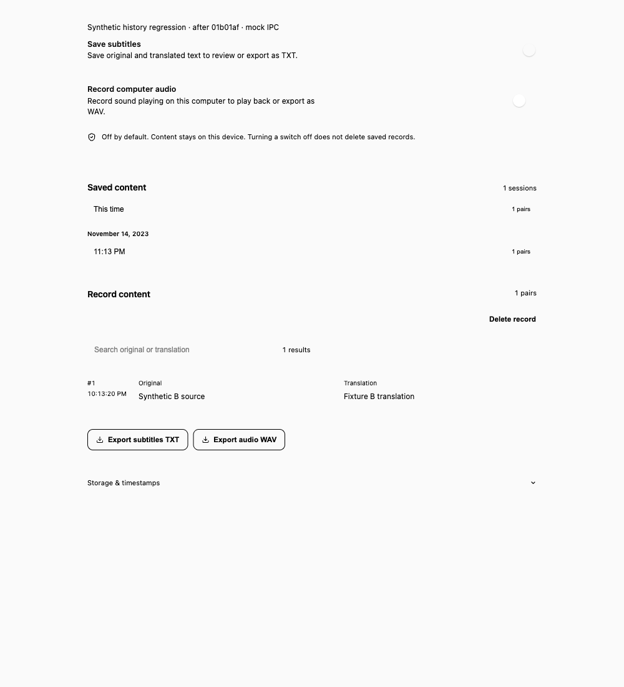

# History interaction regression (#77)

Source before: `5f2a595cbc276d6f45ec016ebbef08f6a01d27cb`.
Source after: `01b01af09c167d50c6ed95dda329903523961b73`.
The subsequent evidence-only commit does not change the implementation.

## Evidence boundary

The screenshots render the real SessionExport component and its existing CSS in
an isolated component harness, with synthetic IPC responses. They are not the
full native Settings window. No native dialog, provider, system audio, Keychain,
real session directory or user history was accessed. The browser fixture is not
added to the production app.

Environment: macOS 26.3.1 (25D771280a), arm64 host, Node 24.13.0,
React/ReactDOM 19.2.8, Vitest 3.2.7, jsdom 26.1.0, Vite 7.3.6,
Tauri frontend API 2.11.1, Rust 1.95.0. Screenshots: installed ego-lite browser,
Chromium 152.0.7977.54, 1000×1100 CSS pixels, en-US locale, UTC timezone,
light component harness. Both versions use the same fixtures and CSS.

Fixture: current plus saved A/B; one synthetic original/translation pair each;
timestamps 1700000000000 and 1700003600000; no audio; stopped session;
empty query and page 0. Export returns false. Delete waits on a manually
resolved promise. Tests additionally cover null cancellation, successful and
failed export, query "Synthetic", page 1 of 3, and 61 synthetic entries/count.

| Scenario | Before | After |
| --- | --- | --- |
| Current TXT export, cancel, wait | Endless Loading subtitles | Same synthetic current pair remains |
| Select A, confirm deletion, click again, select B, resolve A | 2 delete requests; selection resets to current | 1 delete request; B and its pair remain |






## Executable regression checks

```sh
npm ci
npm test -- src/windows/settings/SessionExport.test.tsx
./scripts/check.sh
```

All 16 component cases pass after the fix. The same test file against the
unchanged before component yields 14 failures and 2 passes (delete-confirmation
cancel and transcript-read recovery). The assertions cover cancel/success/error,
query/page preservation, in-flight reads, repeated current selection, synchronous
double clicks, disabled confirmation/aria-busy, deletion retry/success, stale
success/error feedback, closing/reopening, and failed/successful archive clear.
jsdom is a development-only dependency for real React DOM rendering; the
production IPC contract remains unchanged.

Canonical check on macOS: Rust fmt and strict clippy passed; 481 Rust tests
passed, 1 ignored; 178 frontend tests passed across 22 files; updater-manifest
and macOS safety tests passed; typecheck, icons and production build passed.
One pre-existing SoftwareUpdate.tsx fast-refresh lint warning remains (0 errors).
An initial sandboxed run denied localhost listeners and failed 49 socket tests;
the unrestricted synthetic-test rerun passed. Tests need localhost sockets.

## Native acceptance still pending

Do not interpret component screenshots as native Tauri or filesystem acceptance.
Use disposable synthetic content only, with the credential-free fixture mode:

1. On an available signing Mac, run `./scripts/dev-app.sh --ui-only` using the
   canonical `/Applications/mimi-dev.app` (coordinate concurrent workers first).
   Enable Save subtitles, start the synthetic session and stop it. Do not use
   provider credentials or actual system audio.
2. In Save & export, wait for the synthetic sample. Export TXT and cancel the
   native save dialog. Confirm selection, query, page and pair stay visible
   through several archive polls. Save to a disposable temp directory and verify
   the synthetic TXT; repeat cancellation for WAV with the synthetic tone.
3. Test a failed save only in an isolated temporary filesystem fixture. Confirm
   error feedback and transcript retention, then retry a successful save.
4. For saved-history deletion, use a separately isolated fixture backend/session
   directory containing synthetic A and B; never seed or delete the normal
   history directory. Keep A deletion slow, double-click confirmation, select B,
   then finish A. Verify one delete dispatch and that B remains selected. Inject
   delete failure, verify retry, then confirm successful removal. Close/reopen
   during pending export and deletion and check stale feedback is suppressed.

The production native history is intentionally unavailable in UI-test mode, so
step 4 requires an isolated fixture backend, not the user's normal history.
Windows/Linux native UI and slow/failing native filesystem validation are also
pending; cross-platform CI is separate evidence.
