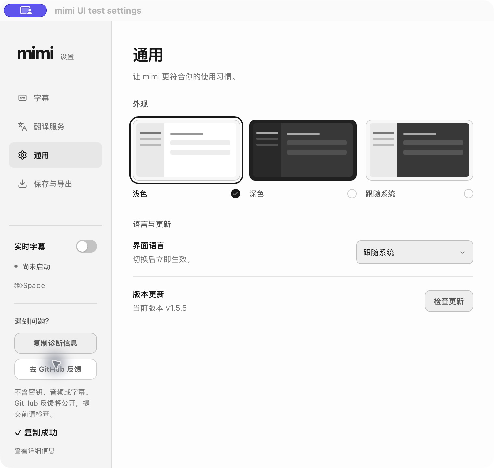
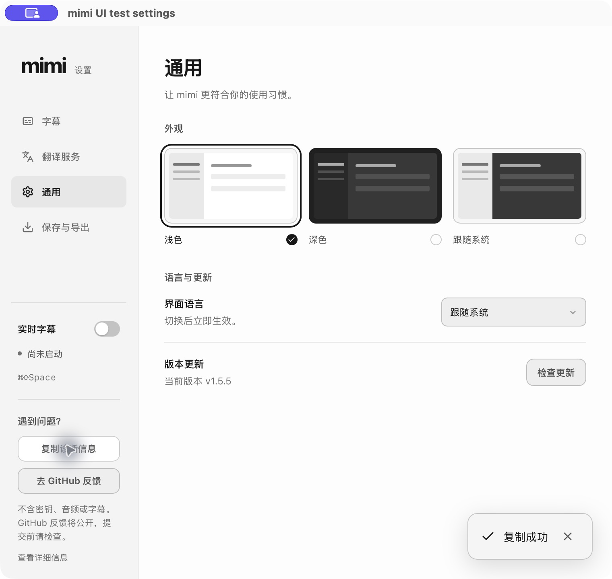

# Windows source and diagnostics acceptance (#72)

Refs #74 (capture/Audio3), #75 (safe diagnostics). These are acceptance steps, not a claim that the reported Teams failure is fixed.

## UI evidence conditions

The screenshots below are untouched macOS native `mimi-dev.app --ui-only` captures, app version 1.5.5, Chinese, light theme, 760×720 logical window (2× pixels). This mode uses synthetic local session state and makes no audio capture, credential or service connection. It is not Windows hardware evidence. Before is the real previous PR iteration at `2ec1b92`, not a reconstructed baseline or the user's private email screenshot.

After screenshots show the same General settings scene: floating toast and automatic disappearance, with no extra sidebar status row. These were captured from the final toast/navigation build (binary SHA-256 `96fab3738fc995916a44ec506502047060c1e27d676488b6aafda8ba64f3fb36`). Native copy → automatic expiry and copy → actual settings navigation were both verified. Closing the UI-test settings window was verified; immediate restoration of a hidden UI-test window was not successfully verified, so normal-mode close/reopen remains in the checklist.

Failure screenshot is the real component running in macOS Chromium with mocked IPC and deliberately denied clipboard access, not a real Windows/ASR failure.

## Reproducible regression checklist

- [ ] Copy diagnostics in General settings: one floating “复制成功” toast; sidebar position and height do not change. Wait 3 seconds: toast disappears.
- [ ] Click copy again before expiry: one toast, renewed 3-second lifetime; no stacking. Close its × button: immediately disappears.
- [ ] Clipboard denied (controlled browser fault injection): readable failure with manual-copy next step, no success announcement; expires after 8 seconds or closes manually.
- [ ] Switch settings pages while feedback is visible or IPC preparation is pending: no toast carries over or reappears from the old operation. Close/reopen settings: no residual feedback.
- [ ] Screen reader receives polite success or assertive failure. Keyboard can focus and dismiss the toast.
- [ ] GitHub action opens only `yuxino/mimi/issues/new`, with whitelist diagnostics and public-content notice. Inspect body before submit; testing must not submit. Oversized body fallback clearly requests paste.
- [ ] Expand diagnostics and copy: visible snapshot is copied. Check no key/token, private endpoint, username/path, subtitle/audio, device name/ID or raw server response appears.
- [ ] Windows: play through actual Teams output; choose that output after stopping capture, restart, verify actual device row. Dynamic default selection follows a changed system default; manual selection stays pinned.
- [ ] Unplug pinned output or save an unavailable selection: explicit unavailable state, no silently changed device. Stop/restart/switch quickly: no stale stream resumes.
- [ ] Compare no PCM, zero PCM and finite nonzero PCM above threshold: unknown/no recent audio/silence/sound are distinct. Synthetic heartbeat never changes capture sound observations. “Sound” must not assert speech or device misselection.
- [ ] Simulate Audio3 auth, setup, recognition timeout and unknown error codes: preserve safe category/stage; no raw payload. Idle heartbeat does not hide auth failure or cause reconnect storms.
- [ ] Compact capsule: English/Chinese/Japanese, idle/listening/error/paused and both modes, equivalent 100/125/150% layouts. Core short labels remain visible; hover/ARIA provides full names. Expanded panel source is on its own line; long local device names remain fully readable.
- [ ] Linux installed package: compact native width 280, expanded 320, no clipping on real compositor/scaling; capture monitor stays bound at start and never claims default-following. This remains a separate actual package QA step beyond CI smoke.

Automated checks: full repository `scripts/check.sh`; timer/repeat/error/cleanup tests in `transientToast.test.ts`; browser `verify-diagnostic-toast.js` measures no layout displacement, repeat expiry, navigation and auto-dismiss. Windows actual output/hotplug/Teams, live service, and installed Linux compositor acceptance remain separate from mock/compile checks.
